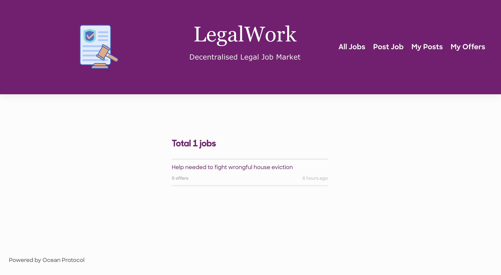
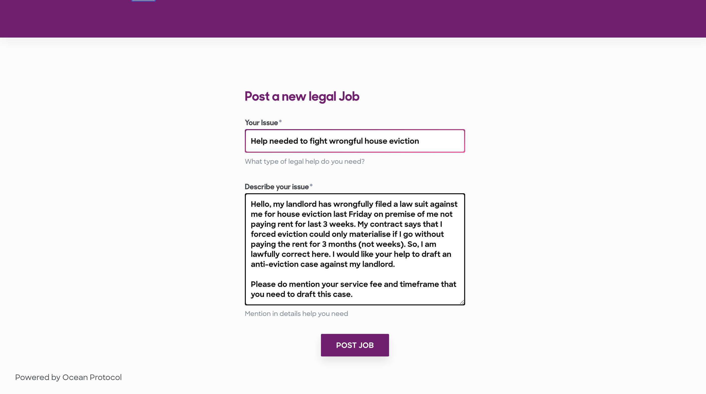
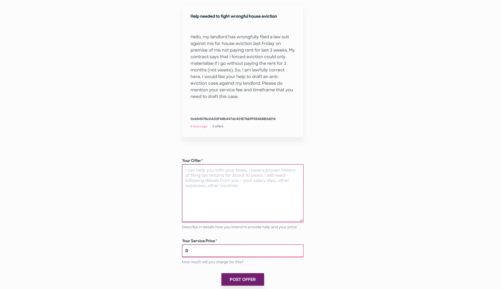
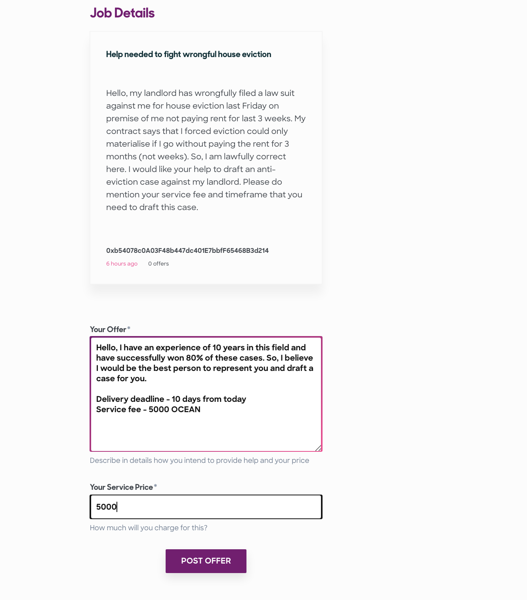
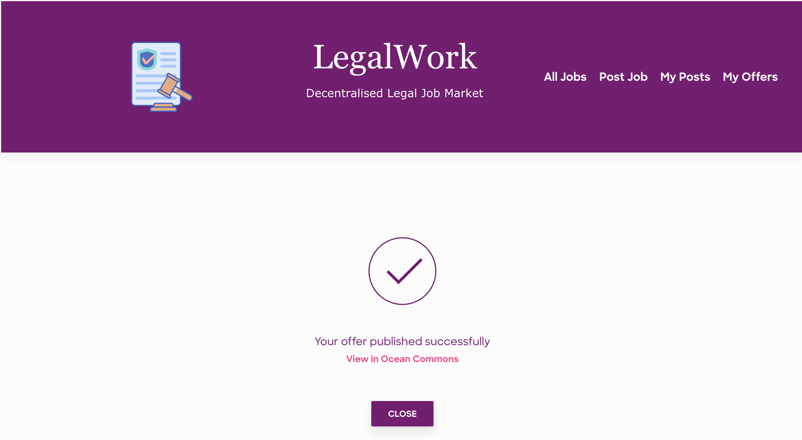
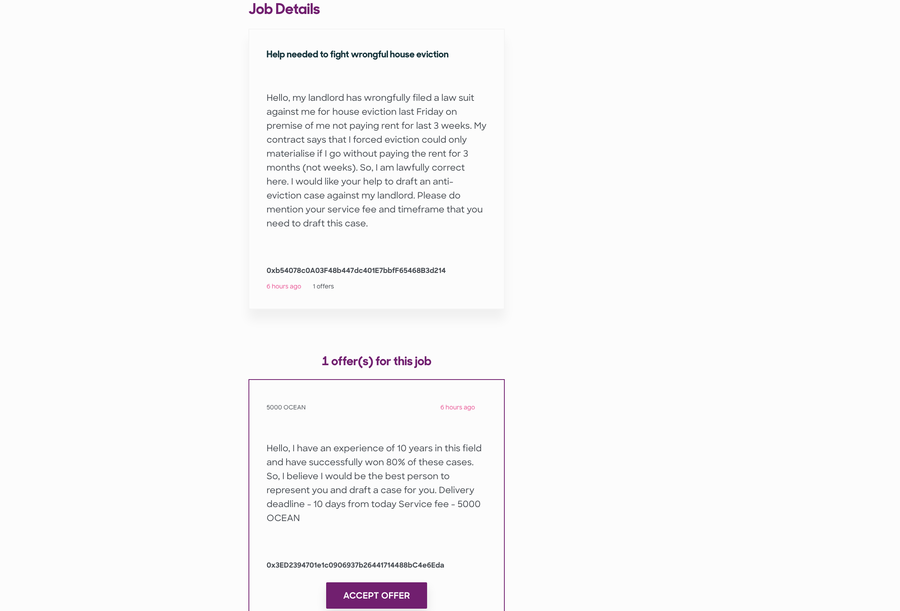
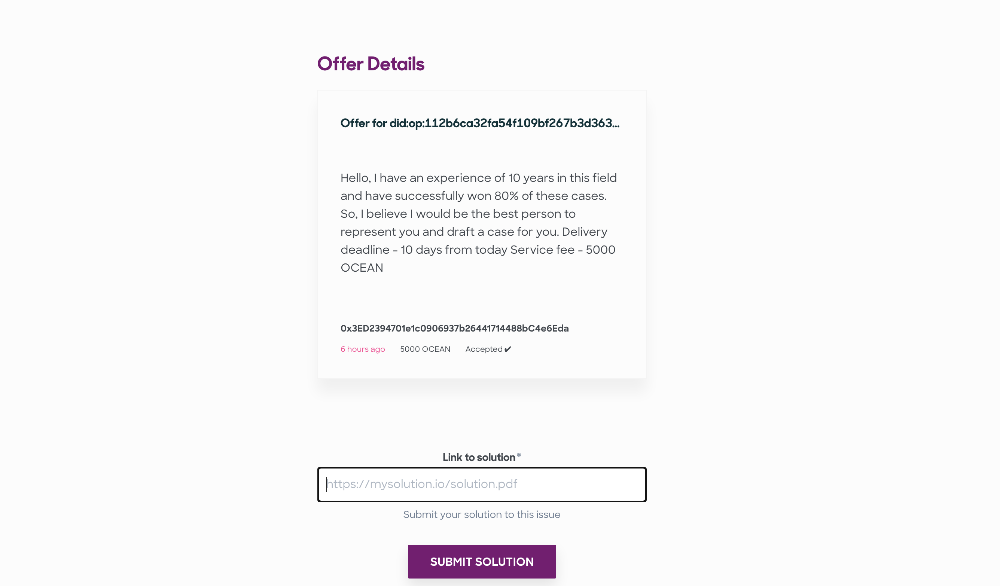

# LegalWork
An upwork-like decentralised legal job marketplace powered by Ocean Protocol

## How it works

  LegalWork is a decentralised legal job market. You can think of this as upwork for web3 world or Gitcoin but specially for Legal industry. Anyone who has a requirement of some freelance legal work can post jobs here (This job will be published in Ocean Protocol). Someone who is a legal expert and wants to apply for that job can propose solution and their service fee (This offer will be published in Ocean Protocol). Job poster will then review each offer and "accept" best offer (This offer acceptance will be registered in Ocean Protocol) that cater to their needs and then legal worker will start working and eventually will submit their solution (this solution will be published in Ocean Protocol). This solution will be a link to the deliverables which can be accessed by Job Poster after paying service fee in terms of OCEAN tokens. Thereby completing a successful exchange using Ocean Protocol.

### Installation and Usage 

1. install dependencies
`npm i`

1. create `.env` file from `.env.example` and fill it
`REACT_APP_BRAND = your-app's-keyword`

1. start the react app
`npm start`

> Note - your app's unique keyword is very important to identify your app's published assets uniquely into Ocean Protocol. Since Ocean Protocol currently doesn't have advanced query features, this workaround was implemented. This keyword will be used as tags and wildcards for search in Ocean Protocol

> Note - backend server is not at all needed. Because this app uses Ocean Protocol as backend entirely. All operations are recorded on Pacific Network of Ocean Protocol

### Screenshots 

#### Homepage (and all posted jobs)

#### Post a New Job (by Job Poster)

#### Job Posting Successful

#### Post an offer for the job (by Legal Worker)

#### Offer Posting Successful

#### Accept Offer (by job poster)

#### Submit Offer solution (by Legal Worker)

